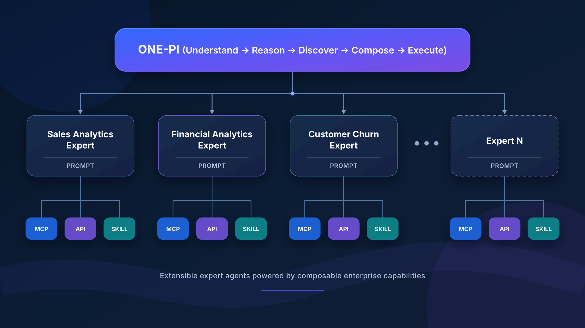
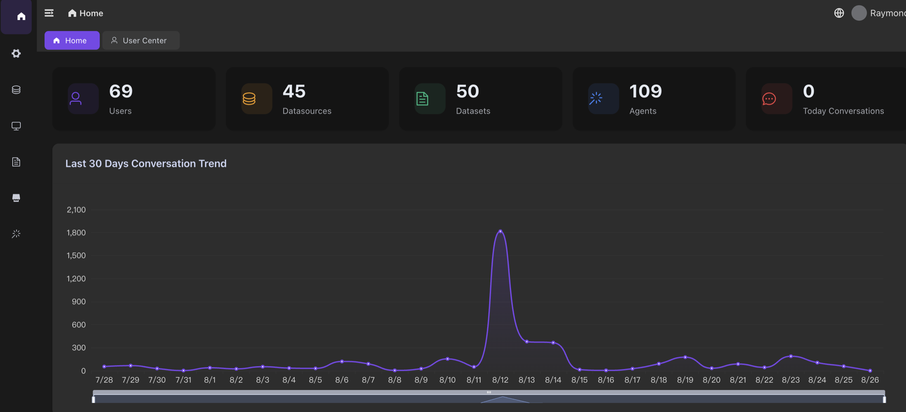

# Open Insight

> 🌐 Languages: **English** | [简体中文](README.zh-CN.md)

### Build the next generation of AI employees for your enterprise.

> **A team of AI employees designed to understand your business, perform specialized work, and deliver real business outcomes.**

It enables AI to understand enterprise systems, enterprise data, enterprise knowledge and personal memory, then execute real business tasks through reusable **Enterprise Skills**.

| Component | Role | License |
|---|---|---|
| **[ARP](https://github.com/OpenInsightHQ/arp)** | The runtime where AI employees work — any model, any tool, any skill | Apache-2.0 |
| **[ONE-PI](https://github.com/OpenInsightHQ/one-pi)** | The reasoning engine — virtual experts that understand, reason, and execute | Apache-2.0 |
| **DMP** | The enterprise core — four learning engines that teach AI your data, systems, and knowledge | Commercial |

Employees work in the browser, zero install. Deploy on your own infrastructure.

📘 **[Deployment Guide →](docs/DEPLOYMENT.md)** · Full story: **[Organization Home](https://github.com/OpenInsightHQ)**

---

## Architecture

> **Enterprise AI starts with understanding the enterprise.**

<p align="center">
  
</p>

### ONE-PI Agent Architecture

ONE-PI connects to an extensible set of expert agents, each equipped with Prompt, MCP, API, and Skill capabilities.

<p align="center">
  
</p>

## Product Experience

### Agent Runtime Platform

<p align="center">
  
</p>

<p align="center">
  
</p>

### Enterprise Data & AI Management

<p align="center">
  
</p>

## Why Open Insight?

Most Data Agent systems are designed to answer questions.

**Open Insight is designed to achieve business goals.**

Enterprises don't measure conversations.

**They measure outcomes.**

## Built for Enterprise, Not Personal AI

Most AI Agents are designed for individual users. Each user installs, configures and manages their own AI environment.

Open Insight takes a different approach. **The enterprise learns once. Everyone benefits.**

Open Insight continuously learns from the enterprise — its data, systems, business knowledge, workflows, skills, and expertise. This knowledge is centrally managed, governed, and made available to employees across the organization.

It runs on enterprise infrastructure, not personal laptops. No installation, no setup, no maintenance burden on employees. It works **24/7** — monitoring systems, processing tasks, and collaborating with other AI agents across departments.

## Roadmap

| Component | Shipped | Next |
|---|---|---|
| **ARP** — where AI employees run | Multi-provider chat · agents & MCP · shared skills · self-hosted deploy | Deeper ONE-PI integration · community agent & MCP templates · local browser extension |
| **ONE-PI** — how AI employees think | Virtual experts · shared skill repository · OpenAI-compatible agent API | **A2A collaboration** · more experts |
| **DMP** — what enterprises get | Four learning engines · governed enterprise core *(commercial)* | Deeper enterprise knowledge base · more enterprise connectors · deeper governance |

**A2A, redefined.** Multi-agent systems let one framework orchestrate many agents. A2A in Open Insight is different: every person commands their own AI, and the collaboration that used to happen person-to-person now happens agent-to-agent — with humans approving what matters.

---


## Community & Enterprise Edition

OpenInsight follows an **Open Core** licensing model and is available in two editions:

|                         | Community Edition | Enterprise Edition |
| ----------------------- | ----------------- | ------------------ |
| **Core Platform**       | ✓                 | ✓                  |
| **Deployment**          | Self-hosted       | Self-hosted        |
| **Enterprise Features** | —                 | ✓                  |
| **License**             | Not required      | Required           |

**Community Edition** is free to use and can be deployed without a commercial license.

**Enterprise Edition** includes additional enterprise and commercial capabilities and requires a valid License File issued by OpenInsight.

For more information, see [`LICENSE-COMMERCIAL.md`](./LICENSE-COMMERCIAL.md).

## System Requirements

| Item | Minimum | Recommended |
| ---- | ------- | ----------- |
| CPU  | 4 cores | 16 cores    |
| RAM  | 16 GB   | 32 GB       |
| Disk | 100 GB  | 500 GB      |

**Prerequisites:** Docker 24.07+, Docker Compose v2.26.1+

**OS:** Ubuntu 20.04/22.04, CentOS/RHEL 7.9, CentOS 8.6, RHEL 8.5

## Quick Start

### 1. Clone the repository

```bash
git clone https://github.com/OpenInsightHQ/openinsight.git
cd openinsight
```

### 2. Initialize environment

```bash
bash init-env.sh
```

This generates `env.sh` from `env.sh.example` and automatically fills passwords and keys with random values.

### 3. Set the server IP

Edit the generated `env.sh` and change `HOST_IP` to the actual server IP:

```bash
vi env.sh
```

```env
HOST_IP=192.168.1.100    # Your server IP
```

### 4. Pull images (online)

```bash
bash prepare.sh
```

> Offline: run `bash save-images.sh` on a networked machine, copy `docker-images.tar.gz` to the target server, then run `bash load-images.sh` on the target server.

### 5. One-click install

```bash
bash install_all.sh
```

### 6. Post-install steps

**Community Edition**

No commercial license is required. Once installation is complete, you can access the platform directly.

* **DMP:** `http://<HOST_IP>:30080/dmp/`
* **ARP:** `http://<HOST_IP>:33080/arp/`

**Enterprise Edition**

Enterprise features require a valid License File. After installation, open the DMP management interface and activate the Enterprise License.

📖 For full details, see the **[Deployment Guide](docs/DEPLOYMENT.md)**.

## Configuration

All configuration is stored in `env.sh`, generated from `env.sh.example` by `init-env.sh`.

* **Secrets/Passwords**: automatically generated randomly on first run
* **HOST_IP**: the only setting you must change
* **External middleware**: set `USE_EXTERNAL_MYSQL/REDIS/MINIO=true` to use external services
* **PI Agent LLM**: configure `OPENCODE_API_KEY` and `PI_MODEL` after deployment

## Directory Structure

```text
openinsight/
├── init-env.sh              # Environment initialization
├── install_all.sh           # One-click installation
├── uninstall_all.sh         # One-click uninstall
├── prepare.sh               # Pull Docker images
├── save-images.sh           # Export images for offline deployment
├── load-images.sh           # Import images for offline deployment
├── env.sh.example           # Configuration template
├── common.sh                # Shared function library
├── docs/                    # Documentation
├── mysql/                   # MySQL + initialization SQL
├── mongodb/                 # MongoDB
├── redis/                   # Redis
├── minio/                   # MinIO object storage
├── meilisearch/             # Meilisearch full-text search
├── searxng/                 # SearXNG + MCP
├── codeinterpreter-api/     # Code Interpreter API
├── pi-agent/                # ONE-PI agent service
├── dmp/                     # DMP data management platform
├── arp/                     # ARP agent platform
└── mongo-express/           # Mongo Express administration UI
```

## Service Management

```bash
# Start / stop / restart a single service
cd <module> && docker-compose up -d
cd <module> && docker-compose down
cd <module> && docker-compose restart

# View all service statuses
docker ps --filter "name=openinsight-"

# One-click uninstall (keeps data)
bash uninstall_all.sh
```

## Default Ports

| Service              | Port  |
| -------------------- | ----- |
| DMP                  | 30080 |
| ARP                  | 33080 |
| Code Interpreter API | 8000  |

## License

OpenInsight uses an **Open Core** licensing model.

* Open-source components and materials covered by applicable open-source licenses are provided under their respective licenses, including the **Apache License 2.0**.
* Enterprise features and other proprietary commercial capabilities require a valid commercial **License File**.

See [`LICENSE`](./LICENSE) for the Apache License 2.0 and [`LICENSE-COMMERCIAL.md`](./LICENSE-COMMERCIAL.md) for commercial licensing information.
